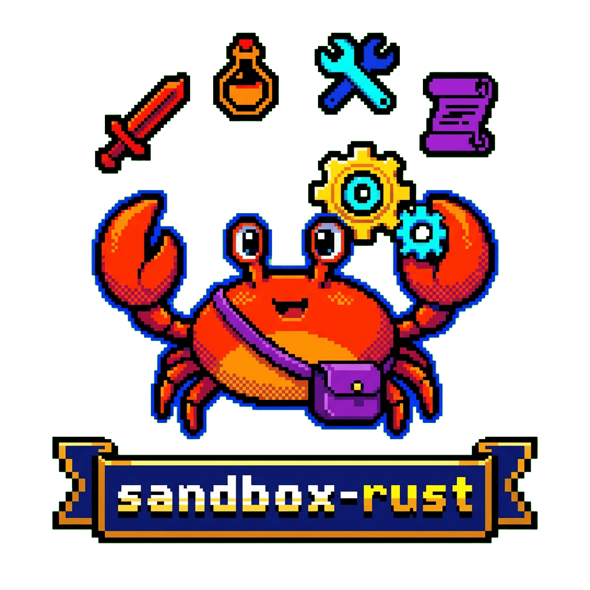

<div align="center">
  

  **🦀 Rust learning sandbox with examples and WebAssembly projects**

</div>

## Overview

A Rust learning sandbox featuring a collection of examples and WebAssembly projects. Includes 17 learning examples covering types, structures, enums, and more, plus WASM compilation and execution demos.

## Features

- **Learning examples** - 17 Rust examples covering core concepts
- **WebAssembly** - Compile Rust to WASM with wasm-bindgen
- **Wasmer runtime** - Load and execute WASM modules
- **DevContainer** - Ready-to-use development environment

## Quick Start

```bash
# Clone the repository
git clone https://github.com/tsilva/sandbox-rust.git
cd sandbox-rust

# Run examples
cd examples
cargo run

# Run WASM example
cd wasmer-example
wat2wasm simple.wat -o simple.wasm
cargo run
```

## Projects

| Directory | Description |
|-----------|-------------|
| `examples/` | 17 Rust learning examples |
| `wasm-example/` | Rust to WebAssembly compilation |
| `wasmer-example/` | WASM execution with Wasmer runtime |

## WebAssembly Workflow

```bash
# Add WASM target
rustup target add wasm32-unknown-unknown

# Compile to WASM
cd wasm-example
cargo build --target wasm32-unknown-unknown --release

# Run with Wasmer
cd wasmer-example
cargo run
```

## Requirements

- Rust with Cargo
- Wasmer runtime
- WABT tools (wat2wasm)

## License

MIT
